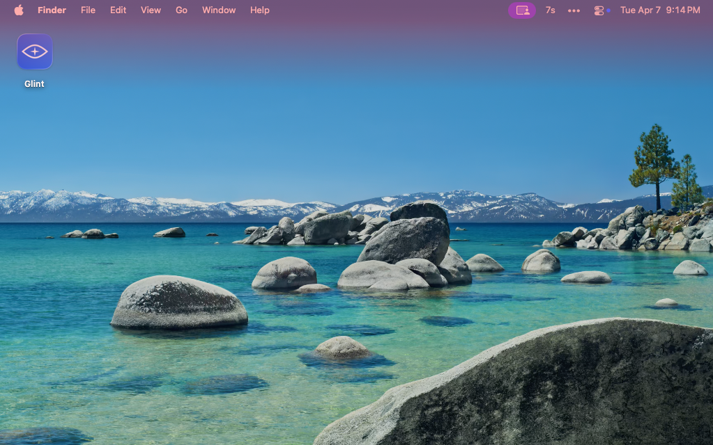

# Glint ✨

**A reminder to look away.** Your eyes will thank you.

A lightweight macOS menu-bar app that reminds you to blink.



Every few minutes, Glint flashes a gentle overlay on your screen — just enough to break the staring habit and give your eyes a rest. Based on the 20-20-20 rule recommended by [eye care professionals](https://www.aoa.org/AOA/Images/Patients/Eye%20Conditions/20-20-20-rule.pdf).

## Features

- **Three flash modes** — solid menu bar, menu bar with glow, or full screen border
- **Timed pause** — 5 min, 10 min, 30 min, 1 hour, indefinitely, or until restart
- **Skips fullscreen apps** — no interruptions during presentations, video, or games
- **Multi-monitor support** — flash all screens or active screen only
- **Countdown in menu bar** — shows seconds remaining during a flash
- **Launch at login**
- **All settings persist** between launches

## Requirements

- macOS 14 (Sonoma) or later

## Build

```bash
git clone https://github.com/seriamo/glint
cd glint
bash Scripts/bundle.sh
open Glint.app
```

Or for development:

```bash
swift build
```

## What's next?

** 🍎 Want Glint on the Mac App Store?** [Let me know here](https://github.com/seriamo/glint/issues/1)

** 💻 Want a Windows version?** [Leave me know here](https://github.com/seriamo/glint/issues/2)

Both are possible depending on interest. A reaction on the issue is enough — no sign-up required.

## License

MIT — see [LICENSE](LICENSE)
